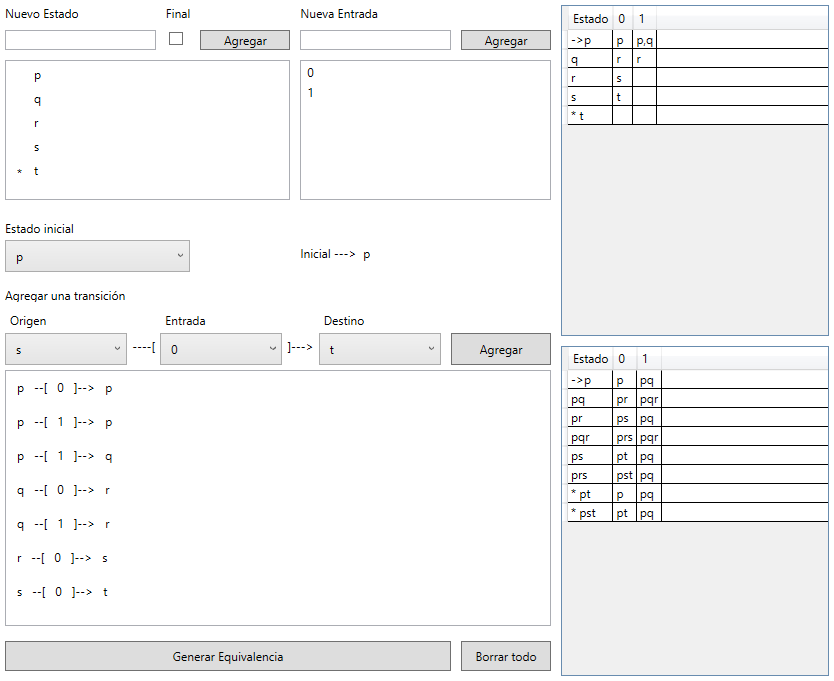

# Autómatas Equivalentes

Aplicación que recibe una tabla de transiciones AFND y encuentra una tabla de transiciones AFD equivalente 

## Instrucciones de uso

1. **Agregar estados**: Insertar el nombre del estado y determinar si el estado es de aceptación, y después presionar el botón de agregar. Repetir para todos los estados del autómata.
2. **Agregar entradas**: Insertar una entrada del alfabeto del autómata y presionar el botón de agregar. Repetir para todas las entradas que evalúa el autómata.
3. **Establecer el estado inicial**: Seleccionar el estado inicial del autómata.
4. **Agregar transiciones**: Para cada transición del autómata, seleccionar el estado donde se encuentra (*origen*), la *entrada* que lee, y a qué estado se dirige al recibir esa entrada (*destino*), y presionar el botón de agregar.
5. **Generar**: Para genera la tabla equivalente, presionar el botón de generar equivalencia. La tabla superior es el autómata ingresado (*AFND*) y la tabla inferior es el autómata equivalente (*AFD*).

